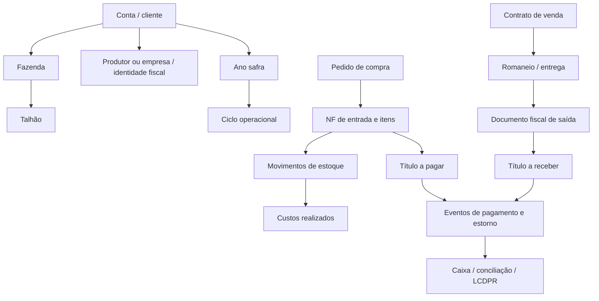

# Auditoria técnica do Arato — 28/09/2026

O código contém falhas críticas de autorização, riscos de perda de registros financeiros e inconsistências na geração de relatórios. A prioridade é proteger operações administrativas e fiscais, preservar o histórico financeiro e corrigir a escrituração antes de ajustes visuais.

## Cobertura e limites

- Inventário: **429 arquivos, 227.473 linhas**, nos diretórios `app`, `lib`, `components`, `hooks`, `campo-app`, `supabase`, mais os dois arquivos principais de migrações, `proxy.ts` e `next.config.ts`. Dependências e artefatos de compilação foram excluídos. São **143 páginas web e 150 arquivos de rotas API**.
- Foi feita varredura automatizada do código, conferência de caminhos de navegação e chamadas literais de API, análise estática e leitura manual dos trechos e fluxos citados abaixo. **Isso não equivale a uma leitura manual linha a linha de todos os 429 arquivos.** O inventário anexo explicita essa distinção.
- Os achados de código são verificáveis nos arquivos citados. A aplicação das migrações e as políticas efetivamente presentes no banco de produção não foram consultadas.
- Não houve alteração funcional, transmissão fiscal, criação de usuários, modificação de dados, envio de mensagens ou exploração dos endpoints. Não foram executados testes de navegador autenticado, restauração real ou validação dos arquivos no PGE.
- Esta análise cobre os 12 eixos solicitados. Validação visual em dispositivos, regras fiscais por operação/UF/regime e revisão manual dos demais fluxos continuam pendentes.

## Resultado por eixo

| Eixo | Avaliação baseada no código | Achados |
|---|---|---|
| Coerência de linguagem | Terminologia e contratos de resposta inconsistentes | A25, A28 |
| Segurança | Crítica: operações administrativas, financeiras e fiscais sem autorização | A01–A07 |
| Rotas | Rota ausente, operações duplicadas e fallback genérico | A18, A24, A28 |
| Fluxos de trabalho | Escritas parciais, concorrência e retentativas inseguras | A08–A13, A20–A22 |
| Avisos críticos | Confirmações insuficientes para o impacto da ação | A23 |
| Menu | Destinos estáticos encontrados, mas relatórios/nomes sobrepostos | A24, A25 |
| Fiscal e tributário | Exportador ECD incompatível com documentação consultada; apurações não demonstradas | A14–A17 |
| Relatórios | Histórico temporal perdido, omissão silenciosa e mistura de estimativas | A09, A15–A17, A19 |
| Layout | Problemas funcionais de React e acessibilidade a validar visualmente | A26, A27 |
| Botões funcionais | Cancelamento de assinatura inconsistente; GPS bloqueado | A18, A26 |
| Cadeia de registro primário | Vínculos podem ser apagados/recriados ou persistidos parcialmente | A08–A13, A20–A22 |
| Hierarquia de chaves; queries | UUIDs não garantem isolamento; filtros, paginação e políticas precisam revisão | A04–A07, A17, A19, A29 |

P0 = contenção imediata; P1 = corrigir antes de confiar no fluxo afetado; P2 = coerência, usabilidade ou manutenção. Essa prioridade não é uma pontuação CVSS.

## Achados verificáveis

### A01 — P0 — Criar usuário, alterar senha e atribuir papel administrativo sem autenticação

**Evidência:** [criar-usuario/route.ts](/Users/ginomigotto/agrofield/app/api/admin/criar-usuario/route.ts:12), especialmente criação, recuperação de usuário existente e `updateUserById` nas linhas seguintes; [proxy.ts](/Users/ginomigotto/agrofield/proxy.ts:19).

O handler usa `service_role`, aceita senha e `hub_acesso` do corpo e não autentica o solicitante. Quando o e-mail já existe e aparece na listagem consultada, redefine sua senha. Também grava o papel no perfil. O proxy libera `/api/*` sem sessão.

**Impacto:** criação de acesso privilegiado e possibilidade de tomada de conta. Não é necessário supor uma falha de RLS para esse caminho.

**Correção:** exigir administrador autenticado antes de ler/processar a operação, restringir papéis e contas permitidos, separar criação de usuário de recuperação de senha e registrar auditoria protegida. Verificar os acessos anteriores a esse endpoint.

### A02 — P0 — Leitura e alteração financeiras expostas

**Evidência:** [financeiro/lancamentos](/Users/ginomigotto/agrofield/app/api/financeiro/lancamentos/route.ts:19), [financeiro/baixar](/Users/ginomigotto/agrofield/app/api/financeiro/baixar/route.ts:19), [lancamentos](/Users/ginomigotto/agrofield/app/api/lancamentos/route.ts:18), [lancamentos-cp](/Users/ginomigotto/agrofield/app/api/lancamentos-cp/route.ts:18), [empresa-lancamentos](/Users/ginomigotto/agrofield/app/api/empresa-lancamentos/route.ts:18).

Os handlers usam cliente administrativo sem verificar sessão e vínculo do solicitante com o registro. O PATCH aceita um objeto arbitrário de campos; os endpoints de inserção aceitam `rows` sem lista explícita de campos editáveis.

**Impacto:** consulta, criação, alteração de titularidade, baixa e reabertura indevidas de registros, sujeitos apenas às restrições existentes no banco.

**Correção:** autenticação + autorização por ação + conta derivada no servidor + validação de campos e referências. JWT expirado deve provocar renovação ou resposta 401, nunca servir de justificativa para eliminar autorização.

### A03 — P0 — Operações fiscais e exclusão de NF sem controle de acesso

**Evidência:** [emitir-cte](/Users/ginomigotto/agrofield/app/api/fiscal/emitir-cte/route.ts:14), [emitir-mdfe](/Users/ginomigotto/agrofield/app/api/fiscal/emitir-mdfe/route.ts:13), [excluir-nf](/Users/ginomigotto/agrofield/app/api/compras/excluir-nf/route.ts:98), [diagnóstico de certificado](/Users/ginomigotto/agrofield/app/api/debug/cert-chain/route.ts:55).

As rotas de emissão encaminham identificadores/dados a serviços fiscais sem autenticar o solicitante. Os serviços CT-e/MDF-e rastreados não fazem essa autenticação por conta própria. A exclusão usa acesso administrativo. O diagnóstico afirma ser restrito no comentário, mas não implementa a restrição.

**Impacto:** possibilidade de uso indevido de certificados e serviços fiscais configurados, eliminação de dados e exposição de metadados. A efetivação externa depende da configuração e das validações do autorizador.

**Correção:** autorização fiscal explícita, propriedade de todos os IDs, ambiente fiscal visível e rastreamento de cada solicitação. Não usar uma emissão real para testar a proteção.

### A04 — P0 — Exclusão em massa ignora o vínculo com a conta

**Evidência:** [apoio-bulk](/Users/ginomigotto/agrofield/app/api/apoio-bulk/route.ts:40).

O endpoint verifica usuário/perfil, mas trata `delete-all` antes da validação de conta usada nas outras ações. Aceita `fazenda_ids` ou `conta_id` enviados pelo solicitante e exclui com `service_role`.

**Impacto:** um usuário autenticado com perfil pode direcionar a exclusão a outra conta.

**Correção:** calcular as fazendas autorizadas no servidor e aplicar a mesma autorização antes de qualquer ramo da ação. A confirmação na tela não protege a API.

### A05 — P0 — Políticas SQL permissivas e alteração de privilégios

**Evidência:** [política emergencial](/Users/ginomigotto/agrofield/supabase_migrations.sql:11905), [perfis_tenant](/Users/ginomigotto/agrofield/supabase_migrations.sql:12625), [empresa_lancamentos](/Users/ginomigotto/agrofield/supabase_migrations.sql:13825).

O script cria `FOR ALL TO authenticated USING (true) WITH CHECK (true)` em dezenas de tabelas. Mais adiante remove essa política de algumas, mas isso não demonstra fechamento de todas. A política final encontrada para `perfis` não especifica `FOR SELECT`: permite acesso pela própria linha, mesma conta ou papel interno, sem proteção de colunas como `role` e `conta_id`. As políticas citadas de `empresa_lancamentos` concedem acesso a qualquer perfil `bpo`, sem vínculo com o parceiro/cliente.

**Impacto condicionado ao banco instalado:** leitura/escrita entre contas e possível autoelevação de privilégios se os grants permitirem atualizar `perfis`. Políticas permissivas adicionais não restringem uma política que já permite tudo.

**Correção:** auditar `pg_policies`, grants e triggers efetivos; separar SELECT/INSERT/UPDATE/DELETE; impedir alteração de papel e conta por clientes; vincular BPO ao parceiro correto. Executar testes de isolamento com usuários A/B e anônimo.

### A06 — P1 — Permissões de interface não são uma política central de autorização

**Evidência:** [AuthProvider](/Users/ginomigotto/agrofield/components/AuthProvider.tsx:569), [api-auth](/Users/ginomigotto/agrofield/lib/api-auth.ts:111), [proxy](/Users/ginomigotto/agrofield/proxy.ts:60), [seed-cfops](/Users/ginomigotto/agrofield/app/api/seed-cfops/route.ts:24).

Permissão ausente libera acesso/escrita no cliente. Papéis internos são comparados por listas diferentes e, em outro ponto, por prefixo. O proxy identifica operador de campo por `user_metadata`, que não deve ser a fonte de autoridade. O seed de CFOP autentica o usuário, mas não verifica acesso à fazenda solicitada antes de usar `service_role`.

**Correção:** uma matriz de permissões aplicada no servidor, com conta/ação verificadas e política definida para permissões ausentes. Consultar papel protegido, sem confiar em metadado editável pelo usuário.

### A07 — P1 — UUID/FK não garante pertencimento à mesma conta

**Evidência:** [schema de movimentações](/Users/ginomigotto/agrofield/supabase/schema.sql:97), [schema de romaneios](/Users/ginomigotto/agrofield/supabase/schema.sql:185), [confirmar contrato](/Users/ginomigotto/agrofield/app/api/contratos/confirmar/route.ts:67).

As FKs individuais ligam registros existentes, mas não provam que `insumo_id`/`contrato_id` e `fazenda_id` pertençam à mesma conta. A confirmação consulta a fazenda do contrato, mas cria o CR com `body.fazenda_id` e outros valores enviados pelo cliente.

**Correção:** derivar fazenda, pessoa, valor e moeda do contrato persistido; validar o pertencimento de todas as referências. Onde adequado, usar FKs compostas ou triggers para invariantes de conta. Não inferir segurança pela imprevisibilidade do UUID.

### A08 — P1 — Reprocessar NF apaga o financeiro anterior antes da validação completa

**Evidência:** [limparMovimentacoesEFinanceiroDaNf](/Users/ginomigotto/agrofield/lib/db.ts:2531), [processarNfEntrada](/Users/ginomigotto/agrofield/lib/db.ts:2615).

A limpeza exclui lançamentos por NF, inclusive o vínculo legado, sem filtrar lançamentos baixados. O processamento chama a limpeza antes de verificar se todos os itens possuem ID. Uma falha posterior pode deixar a NF sem o financeiro/estoque anteriores. Valores pagos e vínculos dependentes podem ser perdidos ou bloquear parte da operação por FK.

**Correção:** validar tudo antes; bloquear recriação de títulos liquidados/conciliados; efetuar correções por estorno rastreável; encapsular mudanças em transação. Testar a tentativa de reprocessar uma NF com pagamento parcial.

### A09 — P1 — Pagamentos parciais perdem a distribuição por data e banco

**Evidência:** [baixa financeira](/Users/ginomigotto/agrofield/app/api/financeiro/baixar/route.ts:135), [LCDPR](/Users/ginomigotto/agrofield/app/lcdpr/page.tsx:410).

A baixa acumula `valor_pago`, mas sobrescreve `data_baixa` e `conta_bancaria`. O LCDPR transforma o título em uma única entrada usando esse valor acumulado e a última data.

**Cenário:** R$ 400 pagos em janeiro e R$ 600 em fevereiro viram R$ 1.000 em fevereiro nesse caminho. Isso altera totais mensais e pode deslocar valores entre anos.

**Correção:** pagamentos imutáveis em tabela própria, com valor/data/banco/câmbio/encargos, e relatórios derivados desses eventos. O título deve guardar saldo calculado, não substituir o histórico.

### A10 — P1 — Baixas/adiantamentos não são atômicos nem idempotentes

**Evidência:** [financeiro/baixar](/Users/ginomigotto/agrofield/app/api/financeiro/baixar/route.ts:65).

A aplicação registra o evento, atualiza o saldo do adiantamento e atualiza o CP em chamadas separadas. A baixa normal faz leitura e depois soma/grava; não há chave de idempotência nesse handler. Duas baixas concorrentes podem sobrescrever uma à outra; uma retentativa pode somar novamente o mesmo pagamento.

Também faltam validações de execução para ação, números positivos/finitos, existência do título na baixa normal e compatibilidade de fornecedor/conta entre adiantamento e CP. O tipo TypeScript não valida JSON recebido.

**Correção:** transação no banco, trava ou atualização condicional, chave única por pagamento e validação do estado/transição antes de gravar.

### A11 — P1 — Reabrir título não desfaz todos os efeitos da baixa

**Evidência:** [ramo reabrir](/Users/ginomigotto/agrofield/app/api/financeiro/baixar/route.ts:47) e sincronização das parcelas no final desse arquivo.

O ramo `reabrir` limpa campos do lançamento e retorna. Não reverte ali a parcela financeira anteriormente marcada como paga nem as aplicações de adiantamento. A sincronização na baixa ignora erros das atualizações secundárias.

**Impacto:** título em aberto com parcela paga, ou crédito consumido após reabertura, salvo se houver mecanismo externo no banco que não está demonstrado nesse fluxo.

**Correção:** definir estorno financeiro completo e transacional, com rastreio do evento original e erros propagados.

### A12 — P1 — Confirmação de contrato pode duplicar CR e número

**Evidência:** [confirmar contrato](/Users/ginomigotto/agrofield/app/api/contratos/confirmar/route.ts:77), [salvar na tela](/Users/ginomigotto/agrofield/app/contratos/page.tsx:1097).

O número é `count + 1`, que pode repetir após exclusão ou em concorrência. Duas requisições podem observar `lancamento_cr_id` vazio e criar dois títulos. A atualização do vínculo final não tem erro tratado. Cabeçalho, itens e confirmação são persistidos em etapas independentes.

**Correção:** sequenciador atômico por escopo, unicidade da origem financeira e transação de confirmação. Repetir a mesma solicitação deve devolver o mesmo CR.

### A13 — P1 — Numeração fiscal é reservada por leitura/escrita concorrente

**Evidência:** [NF-e proximoNumero](/Users/ginomigotto/agrofield/lib/nfe/index.ts:260), [CT-e proximoNumero](/Users/ginomigotto/agrofield/lib/cte/index.ts:42).

As funções leem o contador da configuração e gravam o incremento em outra chamada. Duas emissões podem reservar o mesmo número; erros de atualização não são verificados. O fato de incrementar antes de transmitir não torna a reserva atômica.

**Correção:** reserva transacional por emitente/IE quando aplicável/modelo/série/ambiente, unicidade e estados de emissão persistidos. Após timeout, consultar o resultado fiscal antes de retransmitir.

### A14 — P1 — Exportador ECD usa registros incompatíveis com o manual consultado

**Evidência:** [gerarSpedEcd](/Users/ginomigotto/agrofield/app/fiscal/sped-contabil/page.tsx:57), especialmente linhas 178–208.

O gerador trata `I150/I155` como lançamento e partidas. A documentação oficial consultada identifica `I155` como detalhes dos saldos periódicos e `I200/I250` como lançamento e partidas. O código declara leiaute 10; a publicação oficial consultada de janeiro de 2026 é do leiaute 9. Não confundir a versão do programa com o leiaute.

**Impacto:** o arquivo não deve ser apresentado como ECD validada. Não executei o PGE; a incompatibilidade apontada é documental/estrutural.

**Correção:** reconstruir o exportador conforme leiaute aplicável, com casos de referência e validação no PGE. Fonte: [Manual oficial ECD atualizado em janeiro de 2026](https://sped.rfb.gov.br/item/show/7990) e [tabela de registros do manual](https://sped.rfb.gov.br/estatico/66/D1D73A379CB13BC5CDE7B7948B1F6C48967CCE/Manual_de_Orienta%C3%A7%C3%A3o_da_ECD_Leiaute_9_janeiro_2026.pdf). A tabela foi consultada no conteúdo indexado; a abertura integral do PDF expirou.

### A15 — P1 — Seleção de movimentos contábeis inclui estados indevidos

**Evidência:** [consulta ECD](/Users/ginomigotto/agrofield/app/fiscal/sped-contabil/page.tsx:283), [conversão](/Users/ginomigotto/agrofield/app/fiscal/sped-contabil/page.tsx:327).

O comentário diz “apenas liquidados”, mas `.neq('status', 'em_aberto')` também aceita cancelados, previstos e vencidos. Filtra o exercício por `data_lancamento` e escreve `data_baixa`, podendo produzir datas fora do exercício. Usa `valor_pago ?? valor` sem reconstruir eventos de pagamento nem explicitar o regime contábil adotado.

**Correção:** definir origem contábil e regime, selecionar estados explicitamente, validar datas do arquivo e reconciliar balancete/razão. Tratar erros de consulta em vez de gerar arquivo vazio.

### A16 — P1 — DRE mistura estimativas e valores realizados; tributação fixa

**Evidência:** [DRE](/Users/ginomigotto/agrofield/app/relatorios/dre/page.tsx:277), [receitas e deduções](/Users/ginomigotto/agrofield/app/relatorios/dre/page.tsx:292), [custos](/Users/ginomigotto/agrofield/app/custos/page.tsx:357).

Na ausência de receita de contratos, a DRE atribui a `receita_real` uma estimativa por produção × preço orçado, com preço padrão 120. Soma valores de CP sem converter USD no trecho analisado. Aplica 1,5% e 0,2% de deduções de modo fixo; não resolve ali regime, natureza da operação, opção de recolhimento ou vigência.

**Cenário:** um CP de USD 1.000 entra como 1.000 no acumulador chamado `valorBRL`. Receita estimada positiva pode aparecer no resultado de uma safra sem receita de venda apurada.

**Correção:** separar projetado, contratado, faturado e realizado; documentar regime da DRE; converter moeda com fonte/data; apurar tributos por regra configurada e validada. Não se afirma que as alíquotas sejam erradas em todos os casos: o problema é aplicá-las universalmente.

### A17 — P1 — DRE consulta relação não definida nos SQLs e ignora erros

**Evidência:** [DRE principal](/Users/ginomigotto/agrofield/app/relatorios/dre/page.tsx:211), [ciclos auxiliares](/Users/ginomigotto/agrofield/app/relatorios/dre/page.tsx:330).

Consulta `contas_pagar`, enquanto a escrita financeira rastreada usa `lancamentos`. Não foi encontrada criação dessa tabela/view nos SQLs examinados. As respostas extraem somente `data`; erro de consulta passa a lista vazia.

**Impacto condicionado ao banco:** se a relação não existir, a DRE pode omitir despesas sem alertar. Mesmo que exista uma view criada fora do repositório, a implantação não é reproduzível e faltam controles de erro.

**Correção:** confirmar a definição real da relação, versioná-la ou corrigir a origem; interromper cálculo quando qualquer fonte obrigatória falhar.

### A18 — P1 — Cancelar assinatura não cancela no provedor

**Evidência:** [cancelarAssinatura](/Users/ginomigotto/agrofield/app/admin/faturamento/page.tsx:236).

O botão chama `/api/asaas/cancelar`, sem handler correspondente encontrado, ignora o status HTTP e marca a assinatura como cancelada no banco e na tela.

**Impacto:** a interface pode indicar cancelamento enquanto cobranças externas continuam.

**Correção:** implementar o endpoint autorizado e a integração; só concluir após confirmação do provedor; tratar falhas/retentativas e reconciliar estados. Testar com provedor simulado ou sandbox.

### A19 — P1 — Relatórios sem paginação e paginação sem desempate

**Evidência:** [consultas DRE](/Users/ginomigotto/agrofield/app/relatorios/dre/page.tsx:224), [ECD](/Users/ginomigotto/agrofield/app/fiscal/sped-contabil/page.tsx:283), [listarLancamentos](/Users/ginomigotto/agrofield/lib/db.ts:727).

DRE e ECD não paginam as fontes transacionais citadas. Se o limite da API for alcançado, os totais ficam incompletos. Há listagens financeiras corretamente paginadas, mas ordenadas apenas por vencimento, sem desempate único; empates e alterações durante a consulta fragilizam a consistência das páginas.

**Correção:** agregação SQL/RPC sobre o conjunto completo, erro explícito em consulta incompleta e ordenação determinística por data + ID; para exportações, usar snapshot coerente. Validar com volume acima do limite configurado da API.

### A20 — P1 — Backup pode informar sucesso com tabelas vazias por erro

**Evidência:** [lista de tabelas](/Users/ginomigotto/agrofield/app/api/backup/route.ts:6), [executarBackup](/Users/ginomigotto/agrofield/app/api/backup/route.ts:110), [schema fazendas](/Users/ginomigotto/agrofield/supabase/schema.sql:12), [contas](/Users/ginomigotto/agrofield/supabase_migrations.sql:2770).

A mesma query `.eq('fazenda_id', fazendaId)` é usada em todas as tabelas, inclusive `fazendas`, cuja identidade é `id`, e `contas`, que não tem esse relacionamento no schema citado. Erro interrompe a leitura da tabela sem marcar falha; o arquivo e o log podem ser registrados como sucesso. A lista também não representa todos os módulos atuais.

**Correção:** plano de extração por relacionamento, catálogo completo de dependências, manifesto com erros e contagens verificáveis. Validar restauração em banco descartável; um JSON criado não prova recuperabilidade.

### A21 — P1 — Sincronização web pode consolidar operação sem itens

**Evidência:** [campo/sync](/Users/ginomigotto/agrofield/app/api/campo/sync/route.ts:26), criação de pulverização a partir da linha 55.

Insere primeiro o cabeçalho e depois os itens. Se os itens falham, o cabeçalho fica com `origem_op_id`; a próxima tentativa o encontra e termina com sucesso sem completar os itens. A proteção por UUID/índice único é positiva, mas incompleta para o agregado. O endpoint também não autentica o solicitante.

**Correção:** cabeçalho + itens em uma transação, resultado idempotente somente após conclusão integral e autenticação do operador/fazenda. Simular falha na gravação dos itens e reenviar.

### A22 — P1 — Fila offline nativa tem risco de perda e duplicação

**Evidência:** [campo-app/lib/offline.ts](/Users/ginomigotto/agrofield/campo-app/lib/offline.ts:23).

A fila usa leitura/alteração/gravação de um JSON único, sem exclusão mútua. Ao sincronizar, grava apenas os itens que falharam a partir do snapshot inicial. Um item enfileirado durante a sincronização pode ser sobrescrito. O ID da fila não é enviado como chave idempotente da inserção.

**Correção:** armazenamento transacional local, remoção apenas dos IDs confirmados e chave idempotente persistida no servidor. Testar sincronizações simultâneas e interrupção depois da gravação remota.

### A23 — P1 — Confirmações não descrevem integralmente o efeito

**Evidência:** [transmissão NF-e](/Users/ginomigotto/agrofield/app/comercial/faturamento/page.tsx:1218), [exclusão de fazenda](/Users/ginomigotto/agrofield/app/cadastros/page.tsx:2623), [cascata em lançamentos](/Users/ginomigotto/agrofield/supabase/schema.sql:133).

“Transmitir para a SEFAZ?” não identifica ambiente, emitente/IE, destinatário, total e efeito fiscal. A confirmação de fazenda menciona talhões, mas o schema inclui outras dependências em cascata, como lançamentos e contratos; dependendo das FKs efetivas, a exclusão pode apagar mais dados ou ser bloqueada.

**Correção:** confirmação com resumo calculado no servidor, consequências reais, nome/identificador do registro e ação explícita. Para exclusão estrutural, mostrar dependências e contagens; preferir inativação quando houver histórico. Para operações financeiras, informar saldo, juros/desconto, conta, data e reflexo no relatório.

### A24 — P2 — Rotas financeiras duplicadas mantêm regras diferentes

**Evidência:** [lancamentos](/Users/ginomigotto/agrofield/app/api/lancamentos/route.ts:18), [lancamentos-cp](/Users/ginomigotto/agrofield/app/api/lancamentos-cp/route.ts:18), [financeiro legado](/Users/ginomigotto/agrofield/app/financeiro/page.tsx:32), [menu](/Users/ginomigotto/agrofield/components/TopNav.tsx:219).

Dois endpoints fazem essencialmente a mesma inserção em `lancamentos`. O financeiro antigo permanece acessível com câmbio padrão 5,12 e lista estática de bancos. Há também dois caminhos de DRE, em `/custos?aba=dre` e `/relatorios/dre`, expostos por rótulos diferentes.

**Correção:** definir rotas canônicas e serviços de domínio compartilhados. Redirecionar páginas substituídas e documentar quando dois relatórios têm conceitos distintos.

### A25 — P2 — Terminologia de menu, telas e operação não é uniforme

**Evidência:** [menu de resultados](/Users/ginomigotto/agrofield/components/TopNav.tsx:219), [menu de parâmetros](/Users/ginomigotto/agrofield/components/TopNav.tsx:237), [aba inicial de parâmetros](/Users/ginomigotto/agrofield/app/configuracoes/modulos/page.tsx:431), [sidebar antigo](/Users/ginomigotto/agrofield/components/Sidebar.tsx:15).

“Parâmetros Fiscais (NF-e)” abre uma página cuja aba inicial é `aparencia`; “Margens por Safra” abre uma implementação de DRE, ao lado de “DRE Agrícola” em outra página. Existem catálogos de menu distintos; o sidebar antigo não foi comprovado como ativo em todas as telas. Não foram encontrados destinos estáticos ausentes nos caminhos literais examinados de TopNav/SidebarAtalhos.

**Correção:** vocabulário e catálogo de navegação únicos; destinos com aba explícita; padronizar avisos e apresentar CP/CR, CFOP e demais siglas com explicação onde o usuário precisa decidir. Revisar marcas históricas apenas onde aparecem ao usuário.

### A26 — P1 — Header bloqueia o GPS usado pela interface

**Evidência:** [next.config.ts](/Users/ginomigotto/agrofield/next.config.ts:8), [monitoramento de campo](/Users/ginomigotto/agrofield/app/campo/monitoramento/page.tsx:101), [pragas](/Users/ginomigotto/agrofield/app/lavoura/pragas/page.tsx:202).

`Permissions-Policy` envia `geolocation=()` globalmente. As telas chamam `navigator.geolocation.getCurrentPosition`, que fica bloqueado em navegadores que aplicam essa política, mesmo se o usuário quiser permitir.

**Correção:** permitir geolocalização para a própria origem/rotas necessárias e testar em HTTPS em dispositivo real, inclusive permissão negada e indisponibilidade de GPS.

### A27 — P1/P2 — Problemas de React e validação visual pendente

**Evidência:** [admin/dados](/Users/ginomigotto/agrofield/app/admin/dados/page.tsx:158), [pesagem](/Users/ginomigotto/agrofield/app/balanca/pesagem-avulsa/page.tsx:819).

`admin/dados` retorna antes de `useCallback/useEffect` conforme uma permissão assíncrona: altera a ordem/quantidade dos hooks entre renders. O lint também detecta componentes declarados durante render na pesagem, com risco de remontagem. Há botões só com símbolos nas telas de cadastro, cujo nome acessível e foco precisam revisão.

**Correção:** hooks incondicionais, componentes estáveis e testes de teclado/foco. Revisar contraste, zoom 200%, tabelas, modais e responsividade em desktop/celular. Não houve captura de tela; não se atribui aprovação visual com base apenas em CSS.

### A28 — P2 — Respostas de API e página inexistente confundem o tratamento de erro

**Evidência:** [confirmar contrato](/Users/ginomigotto/agrofield/app/api/contratos/confirmar/route.ts:150), [emissão CT-e](/Users/ginomigotto/agrofield/app/api/fiscal/emitir-cte/route.ts:59), [módulo genérico](/Users/ginomigotto/agrofield/app/[modulo]/page.tsx:121).

As APIs alternam `ok/error`, `sucesso/erro` e outros formatos. A confirmação de contrato retorna 207 com `error`, que um cliente pode interpretar como sucesso HTTP; a tela de contratos examinada verifica `json.error`, o que reduz esse problema nesse consumidor. O fallback de módulo desconhecido apenas renderiza “Página não encontrada”, sem `notFound()`.

**Correção:** contrato de resposta consistente, estados parciais explícitos e erro HTTP adequado; página inexistente com semântica 404. Não substituir mensagens de negócio por exceções técnicas cruas.

### A29 — P1/P2 — Queries dinâmicas e trilha de auditoria carecem de garantias

**Evidência:** [filtro financeiro](/Users/ginomigotto/agrofield/app/api/financeiro/lancamentos/route.ts:50), [patch financeiro](/Users/ginomigotto/agrofield/app/api/financeiro/lancamentos/route.ts:78), [registrarLog](/Users/ginomigotto/agrofield/lib/db.ts:15).

Datas recebidas são interpoladas em expressão PostgREST `.or()` sem validar formato; isso é risco de manipulação/erro de filtro, não prova de SQL injection clássico. O PATCH não limita campos. A auditoria no cliente é opcional, recebe identidade informada pelo chamador e só registra aviso no console se falhar.

**Correção:** validar datas/UUIDs/enumerações, lista permitida de campos, escopo de conta independente do filtro e auditoria no servidor vinculada à operação. Logs críticos devem ser protegidos contra alteração e conter antes/depois, autor verificado e identificador da solicitação.

## Cadeia de registros e hierarquia recomendada

`id` é a identidade de uma linha; `conta_id` é o limite organizacional; `fazenda_id`, `produtor_id`, `empresa_id`, `ano_safra_id` e `ciclo_id` representam relações diferentes. Não devem ser intercambiáveis nem usados como substitutos implícitos de autorização.

O diagrama expressa a cadeia que precisa ser conciliável; não afirma que todas essas ligações já sejam impostas pelo banco. Contratos podem gerar previsões antes da entrega/faturamento, mas a passagem de previsão para realizado precisa impedir dupla contagem.

Invariantes necessárias: todo filho deve ter pai válido e conta compatível; cada efeito financeiro/estoque precisa de origem única; confirmação integral ou nenhuma gravação; estorno preserva o original; documento autorizado não é apagado como rascunho; pagamento tem identidade e data próprias; soma de itens/parcelas coincide com o cabeçalho dentro da regra de arredondamento.

## Validações executadas

| Verificação | Resultado | Limite |
|---|---|---|
| TypeScript: `tsc --noEmit --incremental false` | Passou | O tsconfig exclui campo-app, scripts e funções Supabase |
| Testes existentes de ANTT, MDF-e e destinatário de transferência | 17 passaram | Executados com `node:test` e transpile local TypeScript/CommonJS; não cobrem autorização, pagamentos, RLS ou ECD |
| `npm run lint` | Falhou | 535 erros e 506 avisos em 439 arquivos locais reportados, excluída a cópia em `.claude/worktrees` da contagem |
| Categorias predominantes do lint | 234 entidades JSX não escapadas; 126 `any`; 57 links HTML; 46 setState em effect; 34 require | Quantidade de lint não equivale a quantidade de falhas de negócio |
| Menus principais, caminhos literais | Destinos estáticos encontrados | Não prova permissões, abas, renderização nem funcionamento dos cliques |
| Chamadas literais de API nas páginas | `/api/asaas/cancelar` sem implementação encontrada | Expressões construídas dinamicamente precisam rastreamento adicional |
| Produção, banco real e PGE | Não executado | Sem certificação de ambiente ou conformidade fiscal |

## Ordem de correção e critérios de aceite

1. **Conter acessos indevidos:** A01–A06. Toda operação privilegiada responde 401 sem sessão, 403 para conta/papel indevido e autoriza somente o caso permitido. Incluir acessos diretos ao Supabase na matriz de teste.
2. **Preservar histórico e atomicidade:** A07–A13, A20–A22. Testar concorrência, timeout e falha em cada etapa. Repetir uma solicitação não duplica efeitos; estornar restaura saldos e mantém evidência.
3. **Reconciliar relatórios e fiscal:** A14–A19. Dataset conhecido com BRL/USD/barter, duas fazendas, pagamentos parciais entre exercícios e mais registros que o limite da API. Comparar título, pagamentos, banco, estoque, DRE e exportações. Validar ECD/LCDPR nos mecanismos oficiais aplicáveis.
4. **Uniformizar interação:** A23–A29. Resolver rota ausente, GPS e hooks; revisar confirmações, nomes, telas substituídas e acessibilidade com navegador autenticado.

Para a revisão manual integral, o [inventário de cobertura](/Users/ginomigotto/agrofield/AUDITORIA_INVENTARIO_2026-09-28.csv) deve ser usado como checklist por módulo. As frentes ainda não percorridas integralmente incluem folha/RH, hedge, seguros, consórcios, parcerias, todos os relatórios, integrações WhatsApp/SIEG, funções Supabase e os fluxos nativos completos. As ocorrências de análise estática estão na [lista de lint](/Users/ginomigotto/agrofield/AUDITORIA_LINT_2026-09-28.csv).

## Referências externas e alcance fiscal

O uso administrativo do Supabase exige autorização no servidor: a documentação confirma que chaves de serviço podem contornar RLS e que `user_metadata` não é fonte segura de autorização. [Documentação oficial de RLS](https://supabase.com/docs/guides/database/postgres/row-level-security).

A Receita publica leiaute e manual próprios do LCDPR. A avaliação de pagamentos neste relatório demonstra perda de informação temporal no código; não substitui conferência de cada registro, titular e enquadramento contra esses documentos. [Documentação oficial LCDPR](https://www.gov.br/receitafederal/pt-br/assuntos/orientacao-tributaria/declaracoes-e-demonstrativos/lcdpr-livro-caixa-digital-do-produtor-rural).

Não foram certificados ICMS por UF, benefícios, retenções, IBS/CBS, contribuições rurais, folha ou demais obrigações. Essa conclusão depende de operações representativas, parametrização real e regras vigentes, além da correção das falhas técnicas listadas.
